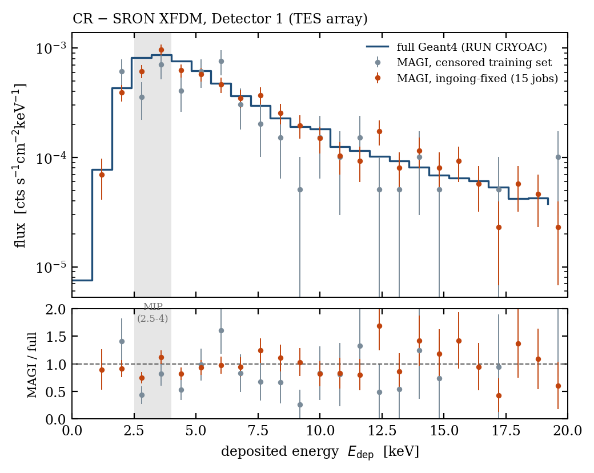
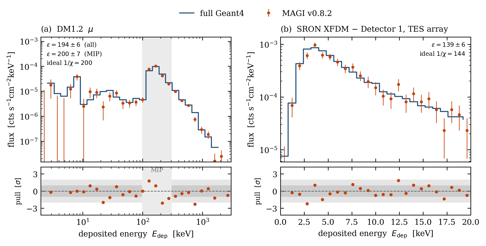
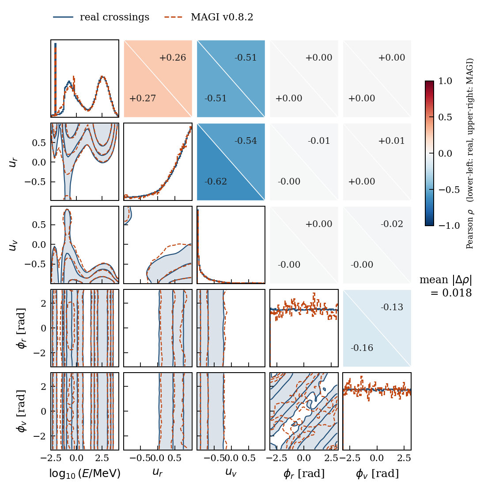
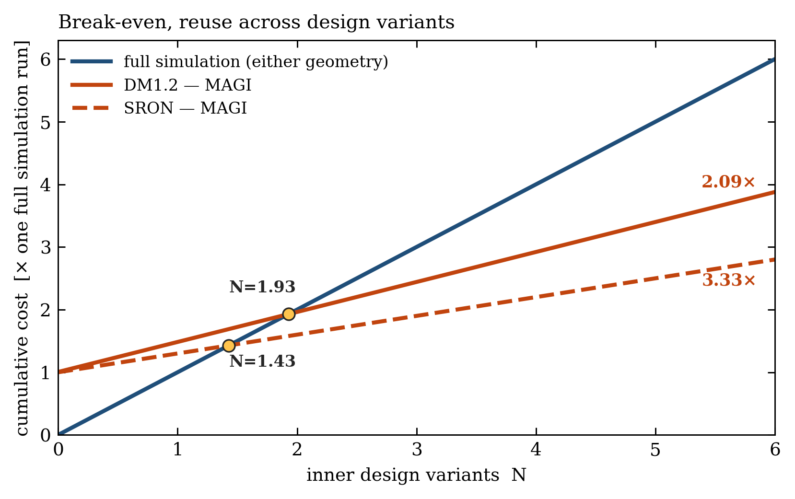

# MAGI

**M**ultivariate **A**utoencoder for particle **G**enerative **I**nference

[](LICENSE)
[](MAGI_package/setup.py)

A Conditional Variational Autoencoder (CVAE) that learns the joint phase-space
distribution of particles crossing a surface in a Geant4 Monte Carlo simulation —
energy, position, direction and particle type — and samples new, physically
consistent events at a fraction of the cost of rerunning the full transport.

It's intended as a drop-in particle source: cut a long simulation at a surface,
pay for the expensive outer transport once, and resample from the learned
distribution instead of rerunning it. That pays off whenever the events reaching
that surface are rare for physical or geometrical reasons — a rarely-triggering
detector, a source buried deep in shielding, a spectral line with poor
statistics. The v0.8 head models the energy spectrum as a gated mixture of a
normalizing-flow continuum and fixed-position line components pinned at measured
atomic transition energies, with a learned conditional prior that preserves
energy-geometry correlations through generation.

Built on `keras`/`tensorflow`. Author: Francesco Monastra ([INAF](https://www.inaf.it)).

## Why this is validated the way it is

Reproducing marginal distributions is table stakes for a generative model. The
claim this repo backs is stronger: MAGI's output is pushed back through the real
Geant4 mass model, and the resulting **detector-level spectrum** is compared
against a full, independent Geant4 simulation of the same setup. That
downstream closure — not just "does the training distribution look right" — is
what the numbers below measure.

<p align="center">
  
</p>

**Detector 1, SRON cosmic-ray model: R = 0.963 ± 0.043** — the ratio of
MAGI-driven to fully-simulated Detector-1 counts, consistent with unity to
better than 1σ, measured against >40,000 full-simulation Detector-1 events.

<p align="center">
  
</p>

Deposited-energy spectra, full Geant4 transport vs. MAGI-driven generation,
for both validated mass models (DM1.2 laboratory cryostat and the SRON X-IFU
model), with Poisson-pull residuals.

<p align="center">
  
</p>

5-D correlation structure of the DM1.2 crossing population (energy, position,
direction), real vs. MAGI-generated — mean correlation-matrix residual 0.018.

<p align="center">
  
</p>

Where the cost actually pays off: cumulative core-hours against the number of
inner-geometry design variants explored, full transport vs. the MAGI
pay-once-transport / resample-many-times path.

See [`docs/manual/magi_manual.pdf`](docs/manual/magi_manual.pdf) for the full
validation writeup, including the honest limitations — most notably a
few-percent species-dependent distortion in the SRON case whose mechanism is
bounded but not yet localized.

## Install

```bash
pip install -r requirements.txt
```

which installs `magi` in editable mode from `MAGI_package/`. To develop the
package itself directly:

```bash
pip install -e MAGI_package/
```

Core runtime deps: `tensorflow>=2.16`, `tensorflow_probability[tf]>=0.24`,
`numpy`, `scipy`, `pandas`, `scikit-learn`, `astropy`, `joblib`, `h5py`,
`seaborn`, `optuna`. Test suite: `pytest MAGI_package/tests/` (142 tests).

## Quickstart

**[`Example_Usage.ipynb`](Example_Usage.ipynb)** is a runnable, fully-commented
walkthrough of the whole pipeline — load → preprocess → detect spectral lines →
build dataset → train → checkpoint → reload → generate → validate → export a
Geant4 source file — on a synthetic source, so it needs no data download and
trains in minutes on CPU. It also documents how to run the same notebook on a
Colab GPU runtime.

**[`MAGI_v0_8_2.ipynb`](MAGI_v0_8_2.ipynb)** is the current stable pipeline
(v0.8.2) run on real data, for a worked example of the full thing end to end.

## Repo layout

- **[`MAGI_package/`](MAGI_package/)** — the installable library (`import magi`).
  See [`MAGI_package/README.md`](MAGI_package/README.md) for install details and
  [`MAGI_package/docs/USAGE.md`](MAGI_package/docs/USAGE.md) for the full usage
  guide, including current limitations (e.g. the sphere-only geometry
  assumption) to know about before training or adapting the model.
- **[`Example_Usage.ipynb`](Example_Usage.ipynb)** — start here.
- **[`MAGI_v0_8_2.ipynb`](MAGI_v0_8_2.ipynb)** — the latest stable version's
  real-data run.
- **[`CandidateLines/`](CandidateLines/)** — an example candidate-line table
  (DM1.2 cryostat), the format `magi.load_candidate_energy_lines` reads. Used
  to pin the v0.8 mixture head's line components at measured energies; see
  [`tools/build_candidate_lines_from_geant4.py`](tools/build_candidate_lines_from_geant4.py)
  for building your own from a Geant4 GDML mass model.
- **[`trained_models/v0_8_2_DM1_2_500k/`](trained_models/v0_8_2_DM1_2_500k/)** —
  one trained checkpoint (DM1.2, v0.8.2), included to show the artifact set a
  training run produces (`*.weights.h5`, `*_config.json`, `*_metadata.json`,
  `*_task_weights.json`, `*_history.json`, `*_summary.txt`,
  `*_quantile_transformers.joblib`) and how `scripts/generate_geant_source.py`
  expects them laid out. Treat the set as one unit.
- **[`scripts/generate_geant_source.py`](scripts/generate_geant_source.py)** —
  generates a Geant4-ready particle source file from a trained model outside a
  notebook; this is what `Geant4_src/PrimaryGeneratorAction` invokes for
  on-demand generation.
- **[`Geant4_src/`](Geant4_src/)** — the Geant4 side of the integration: the
  `PrimaryGeneratorAction`/`PrimaryGeneratorMessenger` that let a Geant4
  application consume MAGI as a particle source (static file or on-demand
  Python generation), plus an `EventAction` geometry fix needed for crossing
  consistency. See its own README for the macro commands and workflow.
- **[`tools/`](tools/)** — scripts useful around a training run: the pass/fail
  acceptance harness (`acceptance_v0_8.py`), the memorisation test
  (`memorisation_test.py` — does the model generate or recall?), synthetic
  stress tests to gate a change before spending real compute
  (`synthetic_stress_test_*.py`), the candidate-line builder
  (`build_candidate_lines_from_geant4.py`), a reference driver for a full
  training run outside a notebook (`run_v0_8_real.py`), and an interactive
  routing-circuit visualizer (`plot_routing_circuit.py`).
- **[`docs/manual/magi_manual.pdf`](docs/manual/magi_manual.pdf)** — the full
  user manual: code structure, the API and its settings, the tools, a worked
  full run, a worked validation, the theoretical foundation, and the validity
  envelope.
- **[`Versions Guideline.md`](Versions%20Guideline.md)** — the model-variant
  naming history, for when a version-specific detail isn't obviously present
  in the current `MAGI_package/magi/core/model.py`.

## Citing MAGI

See [`CITATION.cff`](CITATION.cff) (GitHub's "Cite this repository" button
reads this directly), or cite the repository URL with the version tag you used.

## License

[GPL-3.0-only](LICENSE) — the same license used by
[KDSource](https://github.com/KDSource/KDSource), a sibling tool for Monte
Carlo particle source modeling via kernel density estimation, which this
project has been benchmarked against.
