# v0.8 real CR+Small run — results, v0.7.2 comparison, and where we stand for beta

_Branch `energy-mixture`. Run date 2026-07-24. Model
`CVAE_MixEnergy_ContPhi_TaskAdaptive`: RQS-flow continuum (24 bins, 3 transforms) +
fixed-line Gaussian mixture (widths pinned to X-IFU 4 eV FWHM) + conditional coupling
prior `p(z|cond)`, energy head + gate conditioned on `z` (`z_cond`), `w_gate_aux=2.0`._

The forward development plan that follows from this assessment (continuum fixes first, then
line routing, each synthetic-gated before a real run) is tracked separately; this document is
the evidence and reasoning behind it.

## 1. Run summary

40 epochs each source, CPU, ~81 min total (CR ~48 min best=40, val_nll −3.18; Small
~33 min best=39, val_nll −3.58). Early-stop + ReduceLROnPlateau callbacks active; LR
annealed 2e-4→1e-4 at epoch 22. Driver `tools/run_v0_8_real.py`, log
`logs/v0_8_full_run.log`. Post-run multivariate validation `tools/plot_v0_8_real_corr.py`
(reloads each checkpoint, regenerates 400k events keeping the full feature set).

## 2. Line-integral recovery

| Source | Line | recovery | note |
|---|---|---|---|
| CR | e+e− annihilation (511) | 0.51 | under |
| CR | Al Kα1 | 0.10 | badly under |
| CR | Ni Kβ | 0.20 | under |
| CR | Cu Kβ | 1.13 | over |
| Small | e+e− annihilation (511) | 0.86 | good |
| Small | Al Kα1 | 0.53 | under |
| Small | Cu Kα1 | 0.42 | under |

Lines **regressed vs the earlier 6-epoch smoke run** — CR fluorescence (Al/Ni) is badly
under-generated. Cause (§6): the continuum-focused config + more epochs let the flow explain
line regions, and a scalar `w_gate_aux` cannot lift the rare CR lines against the ~99%
continuum majority.

## 3. Energy spectra (continuum quality)

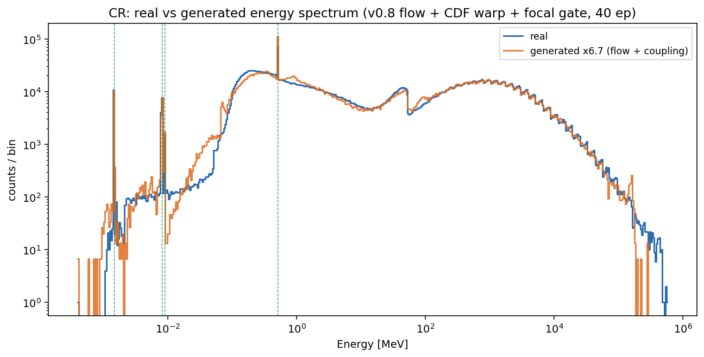
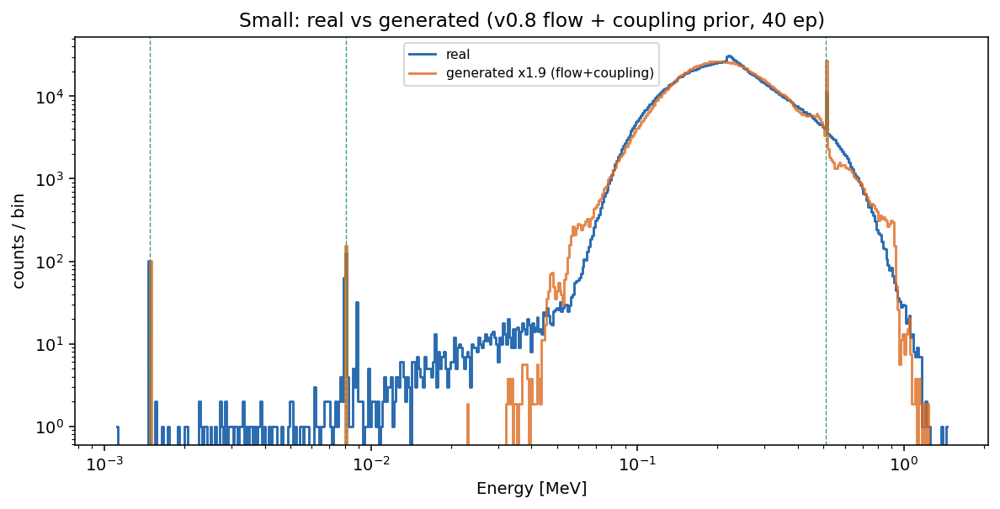

- **CR:** high-E continuum and the muon structure (~100 MeV) are essentially perfect.
  Remaining issues: 511 peak height, and the **low-E rise / Compton edge (~0.02–0.3 MeV) is
  still rounded** (over-smoothed).
- **Small (K-40):** the main bump (~0.2 MeV) is reproduced well and the 511 line is now
  sharp. Remaining issues: the **low-E tail (~0.005–0.04 MeV) is cut** (flow density ≈0
  there), and the tail looks **noisy** — partly a real under-population, partly a plotting
  artifact (1M generated events scaled ×1.9 to the 1.87M real count amplifies Poisson jitter
  in the sparse tail).

## 4. Multivariate generation (pairgrid) and coupling (corr/cov)

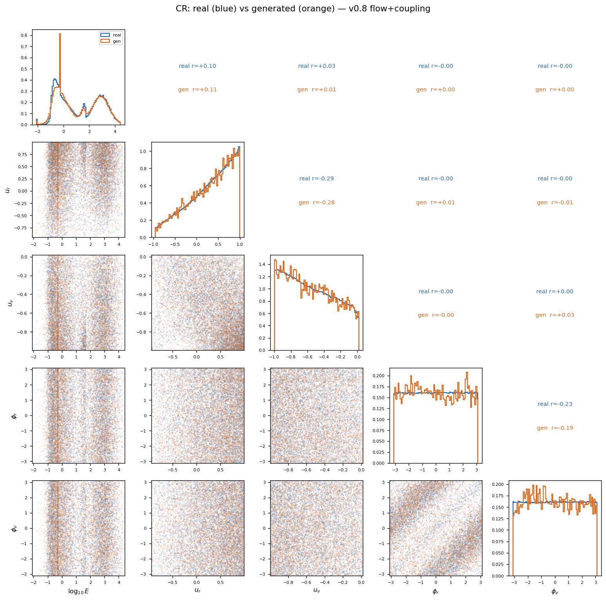
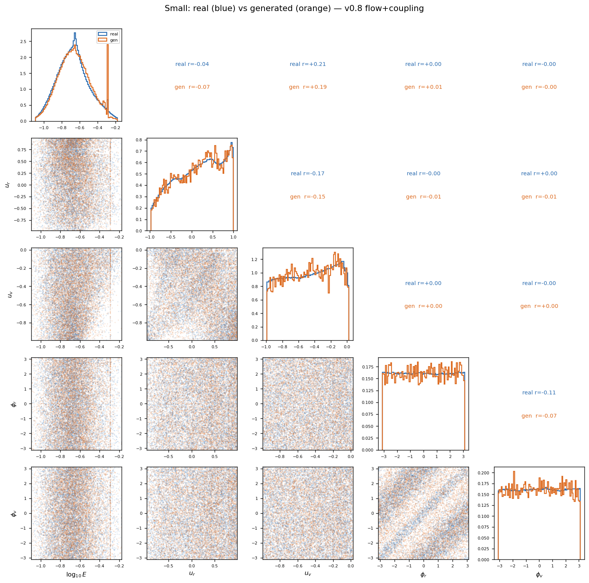
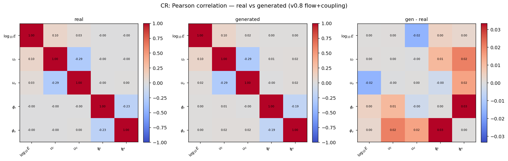
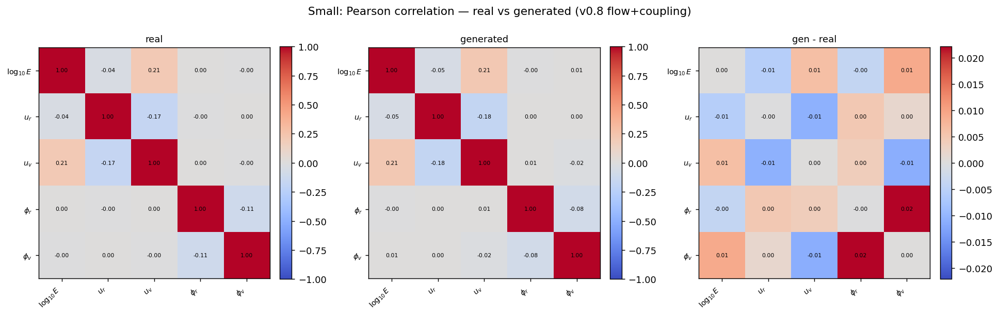
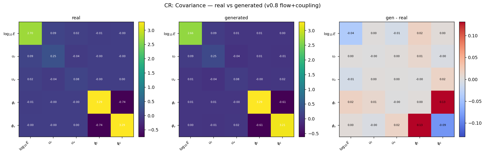
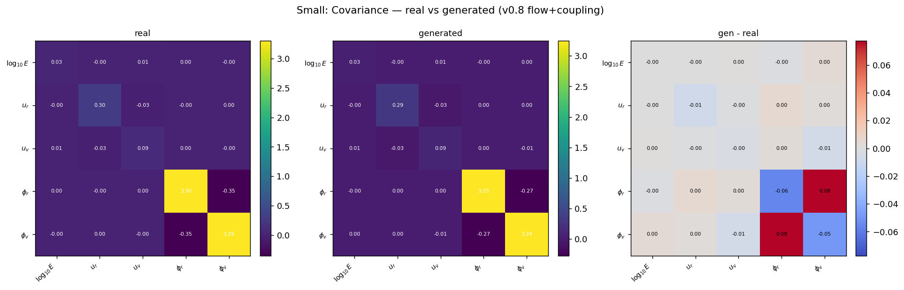

**The coupling prior is validated on real data — the headline result.** Every real
cross-correlation over (logE, u_r, u_v, φ_r, φ_v) is reproduced within ±0.04 (CR) / ±0.02
(Small):

| coupling term | CR real → gen | Small real → gen |
|---|---|---|
| logE ↔ u_r | +0.10 → +0.11 | −0.04 → −0.05 |
| logE ↔ u_v | +0.03 → +0.01 | **+0.21 → +0.21** |
| u_r ↔ u_v | −0.29 → −0.28 | −0.17 → −0.18 |
| φ_r ↔ φ_v | −0.23 → −0.19 | −0.11 → −0.08 |

The strongest physical coupling (Small logE↔u_v = 0.21) is reproduced exactly; joint shapes
(φ_r–φ_v anti-correlation bands, logE–u_v tilt) appear in the generated scatter; covariance
triptychs agree (largest residual Small φ_r–φ_v cov −0.35→−0.27). The aggregated-posterior/
prior mismatch is closed on real data — `z_cond` + coupling prior preserves the
energy↔geometry coupling at generation.

## 5. v0.7.2 (categorical energy) vs v0.8 (flow + line mixture)

v0.7.2 = `CVAE_CatEnergy_ContPhi_TaskAdaptive`: a per-bin multinomial energy head +
continuous quantile geometry. Artifacts: `Plots/energy_distribution_cr_v072.png`,
`Plots/energy_distribution_K40_v07.png`, `Plots/scatterplot_{CR,K40}_v072.png`; checkpoints
`trained_models/task_adaptive_energy_contphi{,_cr}_run_001/`.

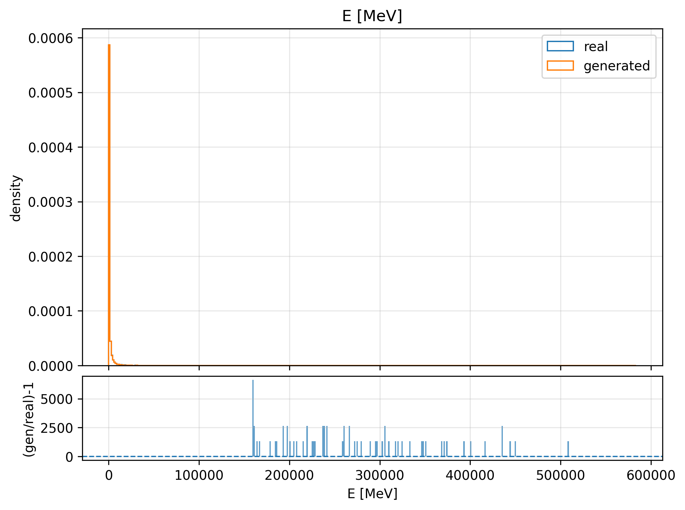
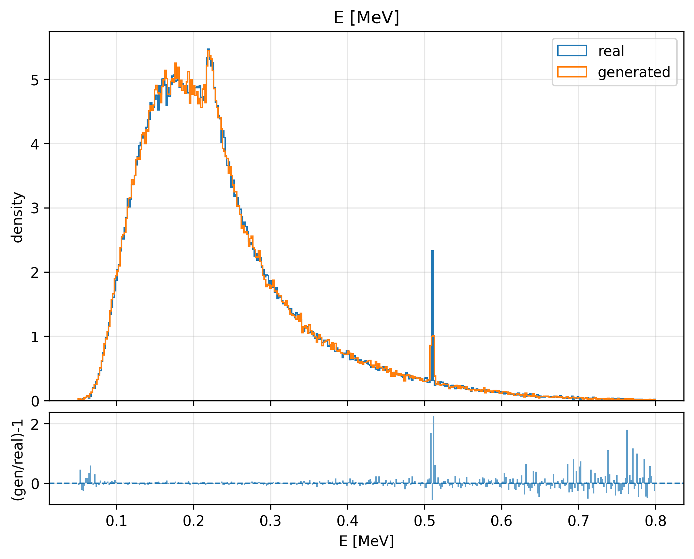
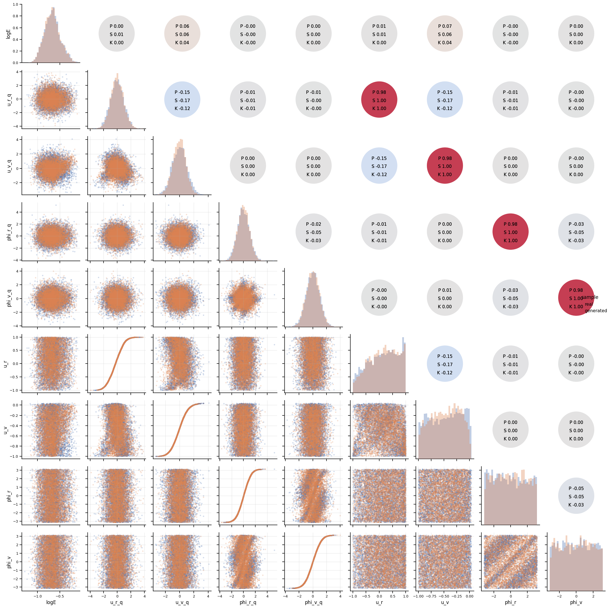

**On the raw 1-D energy marginal, v0.7.2 is still ahead.** Its categorical head reproduces
the entire CR spectrum — 511, fluorescence lines, Compton edge, muon peak, high-E bump —
almost bin-perfectly, because a per-bin multinomial directly fits the histogram. Its K-40
bulk is near-perfect too (the 511 line is under, ~0.43, comparable to v0.8). Its pairgrid
shows geometry↔geometry couplings (u_r↔u_v, φ_r↔φ_v) are captured, though the logE couplings
shown there are weak and were never verified to the ±0.02 standard v0.8 now meets.

**But v0.7.2 has a hard ceiling that disqualifies it for an X-IFU beta:** its lines are only
as narrow as an energy bin. Over CR's ~9-decade log-E axis at 512 bins, a bin at 511 keV is
~20 keV wide — **~5000× the 4 eV X-IFU resolution.** Those "sharp" v0.7.2 lines are box-cars
at bin width, with uniform-within-bin staircase artifacts on the continuum. It physically
cannot represent a detector-resolution line. v0.8 is the only architecture that can: pinned
4 eV line widths, continuous artifact-free continuum, an explicit physically-interpretable
line set, and a now-verified energy↔geometry coupling.

## 6. Root causes of the two remaining v0.8 gaps

**(a) Line under-routing (gate class imbalance).** `model.py:3601`:
`gate_aux_loss = −Σ gate_target · log_pooled_gate` is a plain per-event cross-entropy. ~99%
of events are continuum, so the majority class dominates the gradient; a **scalar**
`w_gate_aux` scales continuum and line supervision equally (raising it also reinforces the
continuum floor), which is why lines *regressed* as training progressed and the flow got
better at explaining line regions. This is a class-imbalance routing failure.

**(b) Continuum knot allocation (flow interval/scale).** `flows.py`: the RQS flow warps a
fixed interval [−B, B] (B = `interval_half_width` = 5) in standardized space
`y_std = (y − y_mean)/y_scale`, with `n_bins` knots spread over that interval; outside it the
tails are standard-normal. Consequences:

- **CR:** the muon tail (to ~10⁶ MeV) inflates `y_scale`, so the low-E bulk occupies a tiny
  fraction of [−5,5]σ → too few knots land on the Compton edge → it is over-smoothed.
- **Small:** the bulk is narrow, so the sparse low-E tail lands many σ out (near/beyond B=5)
  → standard-normal tails take over → tail density collapses to ~0.

## 7. Verdict — were the improvements useful toward beta?

**Yes, architecturally — they are the right and necessary path.** v0.8 is the only route to a
spectroscopy-grade beta (sub-bin, detector-resolution lines; continuous artifact-free
continuum; explicit line set), and its hardest risks (continuum shape capacity, coupling
preservation, sub-bin line widths) are now solved and validated.

**But not yet empirically — v0.8 is not currently more faithful than v0.7.2 on the energy
marginal.** It is slightly behind on the CR low-E edge and on line amplitude. Those are
tuning-level fixes on a proven architecture (§6), not new research risk. v0.7.2 stays the
beta fallback until v0.8 clears the bar: match v0.7.2's marginal fidelity **and** deliver the
physical line widths v0.7.2 cannot.

## 8. Fix development (planned)

Two sequenced cycles, each validated on the synthetic stress tests before a ~80 min real
CR+Small run:

1. **Cycle 1 — continuum fidelity (first):** sharpen the CR low-E edge and restore the Small
   low-E tail. Acceptance: CR edge + Small tail sharpen, CR high-E/muon unchanged, coupling
   within ±0.05.
2. **Cycle 2 — line routing (second):** imbalance-aware gate loss so rare CR fluorescence
   lines are routed correctly. Acceptance: CR Al/Ni/511 recovery ≳0.8 with continuum and
   coupling preserved.

## 9. Results — Cycle 1 (CDF warp) and Cycle 2 (focal gate loss)

A pre-run diagnostic (`tools/_diag_energy_y.py`) overturned the planned "robust y_scale"
idea: CR's Compton edge occupies only ~7% of the affine spline interval (and a robust scale
is *worse*, since the spread is real muon-bump data), while Small's low-E tail sits 4–9σ
below the bulk, *outside* [−B,B], so the RQS spline cannot touch it. The unifying fix was a
**monotone empirical-CDF→N(0,1) pre-warp** inside `ConditionalRQSFlow` (`warp_mode="cdf"`,
knots from `magi.fit_cdf_warp_knots`), making the spline knots density-proportional.

**Cycle 1 (CDF warp) — passed.** Synthetic `--sparse-tail` gate: deep-tail window 0.00
(affine) → 0.96 (cdf), peak preserved. Real run:

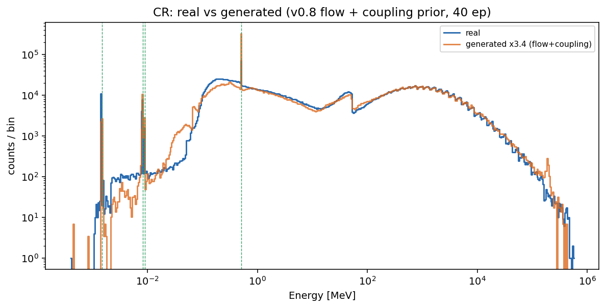
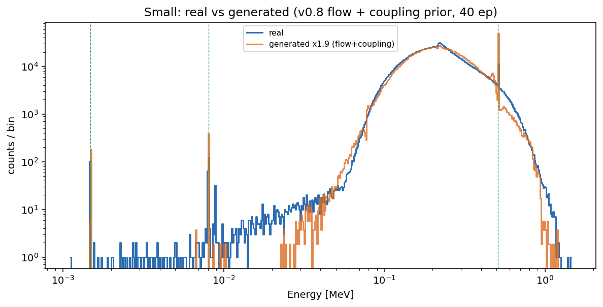

- CR muon notch (~50 MeV) now reproduced (was rounded); mid-E bumps sharper; high-E bulk
  unchanged.
- Small low-E tail (0.02–0.08 MeV) recovered (was absent below ~0.04 MeV), tracking real
  down to ~0.02.
- Coupling preserved (Small logE↔u_v 0.21 → 0.20; all terms within ±0.03).
- Line recovery unchanged (a continuum fix, not a line fix).

**Cycle 2 (focal gate loss) — partial.** The gate cross-entropy is dominated by the ~99%
continuum majority, so rare lines are under-routed. A per-slot **focal** down-weighting
`(1−p)^γ` (γ=2) of the easy majority is stable (self-limiting), unlike inverse-frequency
class weights which blow up for rare lines. Synthetic (0.2%/line): lines 0.79 → 1.13. Real
run line-integral recovery across cycles:

| line | Cycle 0 | Cycle 1 | Cycle 2 |
|---|---|---|---|
| CR e+e− (511) | 0.51 | 0.50 | **0.85** |
| CR Ni Kβ | 0.20 | 0.20 | **0.34** |
| CR Al Kα1 | 0.10 | 0.09 | **0.13** (still under) |
| CR Cu Kβ | 1.13 | 0.98 | **1.80** (over) |
| Small Al Kα1 | 0.53 | 0.43 | **0.98** |
| Small Cu Kα1 | 0.42 | 0.48 | **1.06** |
| Small e+e− (511) | 0.86 | 0.79 | **1.29** (mild over) |

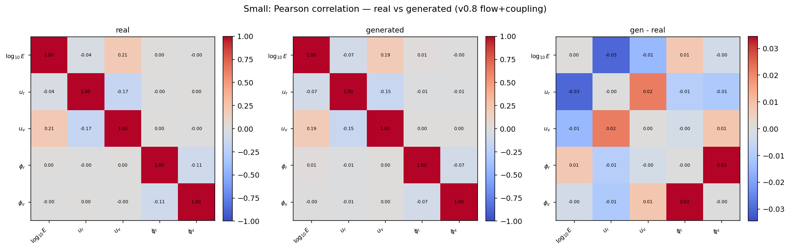

- **Small is now excellent** — all lines ~1.0–1.3.
- **CR improved but incomplete** — 511 and Ni up, but Al still under (0.13) and Cu Kβ
  over-shot (1.80). A *global* focal γ lifts all lines ~uniformly, which cannot match CR's
  heterogeneous line rarities (Al needs ~6×, Cu Kβ ~1×).
- **Continuum preserved** (Cycle-1 and Cycle-2 CR continuum are essentially identical; focal
  did not dig it) and **coupling preserved** (Small logE↔u_v 0.21 → 0.19; within ±0.03).

**Status:** Cycle 1 is a clean win; Cycle 2 substantially improves lines (Small fully, CR
partially). The remaining CR Al/Cu-Kβ imbalance needs **per-line** gate weights (the
`gate_class_weights` machinery is implemented; only manual per-line values remain) — deferred
as a future Cycle 2b. Code committed on `energy-mixture`: CDF warp + focal gate loss;
`gate_class_weights`/`gate_focal_gamma` default off (byte-identical). v0.7.2 remains the beta
fallback until CR Al/Ni clear the ≳0.8 bar.
